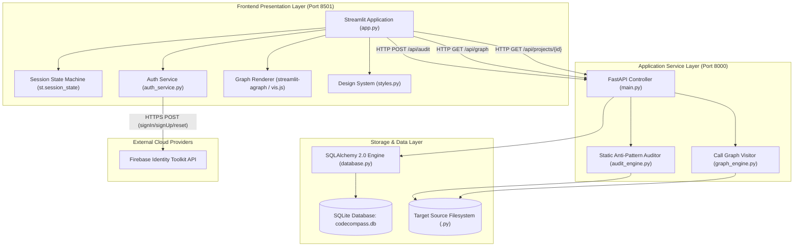
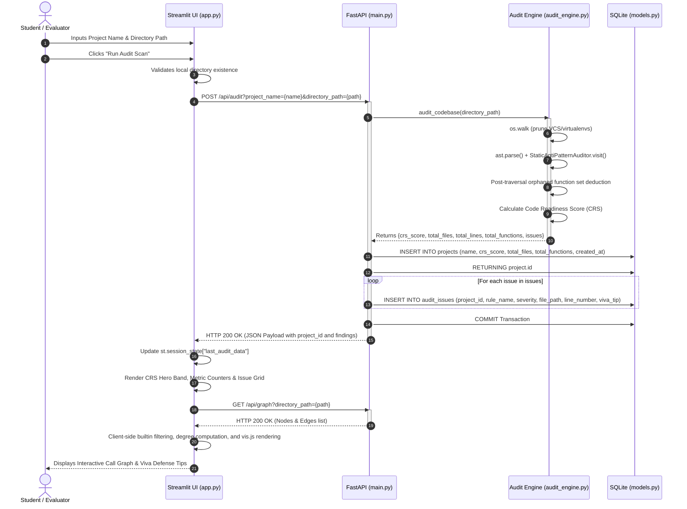
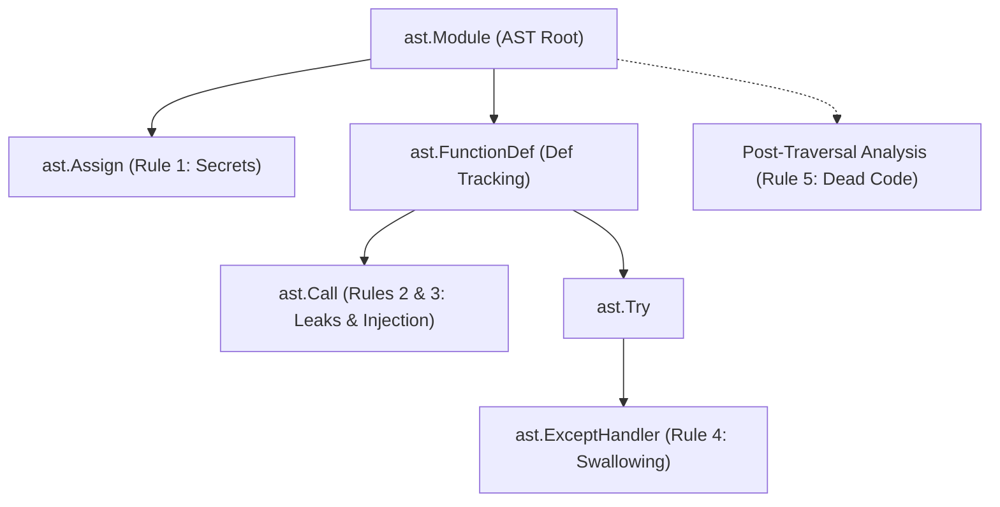
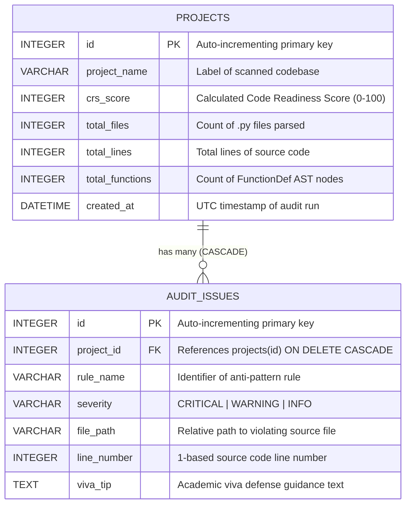

# CodeCompass: Systems Architecture & Technical Specification

> **Document Type:** System Architecture Document (SAD) & Academic Evaluation Specification  
> **System:** CodeCompass — Static AST Code Auditing & Academic Viva Defense Companion  
> **Target Audience:** Academic Examiners, System Architects, Security Auditors, and Software Engineering Evaluators  
> **Version:** 1.0.0-PROD  

---

## Table of Contents

1. [Executive Summary & System Overview](#1-executive-summary--system-overview)
2. [High-Level System Architecture](#2-high-level-system-architecture)
3. [End-to-End Data Flow & Lifecycle](#3-end-to-end-data-flow--lifecycle)
4. [Backend Engine Specifications](#4-backend-engine-specifications)
   - 4.1 [FastAPI Controller Layer (`main.py`)](#41-fastapi-controller-layer-mainpy)
   - 4.2 [Static AST Analysis Engine (`audit_engine.py`)](#42-static-ast-analysis-engine-audit_enginepy)
   - 4.3 [Call Graph Traversal Engine (`graph_engine.py`)](#43-call-graph-traversal-engine-graph_enginepy)
   - 4.4 [ORM & Data Layer (`models.py` & `database.py`)](#44-orm--data-layer-modelspy--databasepy)
5. [Frontend API Integration & State Architecture](#5-frontend-api-integration--state-architecture)
   - 5.1 [Streamlit Reactive Architecture (`app.py`)](#51-streamlit-reactive-architecture-apppy)
   - 5.2 [Authentication Service & Security (`auth_service.py`)](#52-authentication-service--security-auth_servicepy)
   - 5.3 [Client-Side Graph Processing & Visualization](#53-client-side-graph-processing--visualization)
6. [RESTful API Contract Specification](#6-restful-api-contract-specification)
   - 6.1 [`GET /` — Health & Liveness Probe](#61-get----health--liveness-probe)
   - 6.2 [`POST /api/audit` — Static Analysis Pipeline](#62-post-apiaudit--static-analysis-pipeline)
   - 6.3 [`GET /api/projects/{project_id}` — Historical Audit Ingestion](#63-get-apiprojectsproject_id--historical-audit-ingestion)
   - 6.4 [`GET /api/graph` — Structural Call Graph Generation](#64-get-apigraph--structural-call-graph-generation)
   - 6.5 [Third-Party Identity Contracts (Firebase Auth)](#65-third-party-identity-contracts-firebase-auth)
7. [AST Traversal Rules & Static Code Analysis Grammar](#7-ast-traversal-rules--static-code-analysis-grammar)
   - 7.1 [AST Visitor Implementations](#71-ast-visitor-implementations)
   - 7.2 [Rule 1: Hardcoded Secrets & Plaintext Credentials](#72-rule-1-hardcoded-secrets--plaintext-credentials)
   - 7.3 [Rule 2: Unclosed Resource Handles (File Descriptor Leaks)](#73-rule-2-unclosed-resource-handles-file-descriptor-leaks)
   - 7.4 [Rule 3: Dynamic Code Injection Vulnerabilities](#74-rule-3-dynamic-code-injection-vulnerabilities)
   - 7.5 [Rule 4: Silent Exception Suppression](#75-rule-4-silent-exception-suppression)
   - 7.6 [Rule 5: Dead & Orphaned Function Detection](#76-rule-5-dead--orphaned-function-detection)
   - 7.7 [Filesystem Traversal Pruning & Exception Resilience](#77-filesystem-traversal-pruning--exception-resilience)
8. [Code Readiness Score (CRS) Mathematical Specification](#8-code-readiness-score-crs-mathematical-specification)
   - 8.1 [Mathematical Formulation](#81-mathematical-formulation)
   - 8.2 [Deduction Weight Matrix](#82-deduction-weight-matrix)
   - 8.3 [Readiness Stratification Bands](#83-readiness-stratification-bands)
   - 8.4 [Empirical Validation & Benchmark Proofs](#84-empirical-validation--benchmark-proofs)
9. [Database Schema & Relational Modeling](#9-database-schema--relational-modeling)
   - 9.1 [Entity-Relationship Diagram](#91-entity-relationship-diagram)
   - 9.2 [Table `projects` Specification](#92-table-projects-specification)
   - 9.3 [Table `audit_issues` Specification](#93-table-audit_issues-specification)
   - 9.4 [Transactional Semantics & Integrity Guarantees](#94-transactional-semantics--integrity-guarantees)
10. [Academic Viva Defense Evaluation Guide](#10-academic-viva-defense-evaluation-guide)
    - 10.1 [Architectural Trade-Off Justifications](#101-architectural-trade-off-justifications)
    - 10.2 [Examiner Inquiry Defense Matrix](#102-examiner-inquiry-defense-matrix)

---

## 1. Executive Summary & System Overview

**CodeCompass** is a specialized, dual-process static code analysis and pedagogical auditing platform designed for undergraduate and postgraduate computer science students preparing for oral project defenses (vivas). Unlike generic linters (such as Flake8, Pylint, or Ruff) that output flat diagnostic codes, CodeCompass is purpose-built to evaluate code readiness through two primary mechanisms:

1. **Deterministic Static AST Inspection:** Employs Python's standard-library `ast` (Abstract Syntax Tree) parser to identify high-consequence programming anti-patterns without executing untrusted source code.
2. **Pedagogical Viva Defensibility:** Maps every detected anti-pattern directly to a targeted **Viva Defense Tip**, arming students with theoretical justifications, standard-library alternatives, and architectural vocabulary required by academic review boards.

The system computes a deterministic metric termed the **Code Readiness Score (CRS)**, scaling from 0 to 100, which quantifies source code hygiene based on vulnerability severity weights.

```
                      +---------------------------------------+
                      |         Student / Evaluator           |
                      +---------------------------------------+
                                          |
                                          | Web Browser
                                          v
                      +---------------------------------------+
                      |       Streamlit Frontend (UI)         |
                      |   Port 8501 | State-Driven Routing   |
                      +---------------------------------------+
                             |                     |
     REST HTTP / JSON        |                     | Google Identity Toolkit
     (localhost:8000)        |                     | (HTTPS REST)
                             v                     v
+---------------------------------------+   +---------------------------------------+
|        FastAPI Backend Engine         |   |         Firebase Auth Cloud           |
|      Port 8000 | Uvicorn Worker       |   |      (Identity Management)            |
+---------------------------------------+   +---------------------------------------+
        |                    |
        | AST Analysis       | SQLAlchemy 2.0 ORM
        v                    v
+-----------------+   +---------------------------------------+
| Local Codebase  |   |        SQLite Relational Store        |
|  Filesystem     |   |      codecompass.db (WAL Mode)        |
+-----------------+   +---------------------------------------+
```

---

## 2. High-Level System Architecture

CodeCompass is engineered as a decoupled, single-host micro-service pair communicating over HTTP/1.1:



### Component Topology

| Component | Technology | Default Port | Responsibility |
|---|---|---|---|
| **Frontend Web App** | Streamlit `1.62.0` | `8501` | Renders user interface, maintains transient session state, executes client-side graph pruning, and renders metric visualizers. |
| **Backend REST API** | FastAPI `0.141.1` / Uvicorn `0.52.0` | `8000` | Exposes stateless endpoints, coordinates AST visitation, computes the CRS metric, and persists audit runs. |
| **AST Analysis Engine** | Python Standard Library `ast` | In-process (FastAPI) | Parses Python source strings into grammar nodes; performs recursive visitor traversals (`NodeVisitor`). |
| **Relational Storage** | SQLite 3 via SQLAlchemy `2.0.51` | File-based (`codecompass.db`) | Relational persistence of audit sessions and foreign-key-linked findings with cascading deletion. |
| **Identity Service** | Google Firebase Identity Toolkit REST | Remote (`identitytoolkit.googleapis.com`) | Manages user authentication, token issuance, and credential validation (with offline bypass capability). |

---

## 3. End-to-End Data Flow & Lifecycle

The execution lifecycle comprises five distinct sequential phases:



### Data Transition Breakdown:
1. **Request Ingestion:** The client sends an HTTP `POST` request with query parameters `project_name` and `directory_path` to the FastAPI backend.
2. **Directory Filtering & Parsing:** `audit_engine.py` prunes non-application directories (`.git`, `venv`, `ccenv`, `__pycache__`) and converts all `.py` files into Abstract Syntax Trees using `ast.parse()`.
3. **Rule Evaluation & Accumulation:** `StaticAntiPatternAuditor` walks the AST nodes, appending findings with line numbers and viva defense guidance to an in-memory buffer.
4. **Metric Derivation:** The engine subtracts weighted penalties from a base score of 100, flooring the score at 0.
5. **Relational Ingestion:** The FastAPI handler persists a `Project` record followed by associated `AuditIssue` records in SQLite within a single synchronous atomic transaction.
6. **Presentation & Secondary Query:** The frontend ingests the response, caches it in `st.session_state`, and asynchronously requests `/api/graph` to build the interactive caller-callee dependency visualization.

---

## 4. Backend Engine Specifications

### 4.1 FastAPI Controller Layer (`main.py`)

The application controller initializes the relational tables via `Base.metadata.create_all(bind=engine)` at startup and exposes four REST routes:

```python
# Route definitions in main.py
GET  /                          # Health check probe
POST /api/audit                 # Initiates static audit pipeline
GET  /api/projects/{project_id} # Fetches historical project report
GET  /api/graph                 # Computes call graph structures
```

#### Dependency Injection Pattern
Database sessions are injected using FastAPI's `Depends(get_db)`:
```python
def get_db():
    db = SessionLocal()
    try:
        yield db
    finally:
        db.close()
```
This guarantees deterministic cleanup of SQLite database connections, returning them to the pool and releasing OS file locks even in the event of unhandled endpoint exceptions.

### 4.2 Static AST Analysis Engine (`audit_engine.py`)

The audit engine operates strictly at the AST layer without runtime bytecode execution (`eval`, `exec`, or dynamic imports), ensuring that analyzing malicious or untrusted student submissions poses no host vulnerability.

#### Visitor Subclass: `StaticAntiPatternAuditor(ast.NodeVisitor)`
Maintains per-file state:
- `self.issues`: Running list of violation dictionaries.
- `self.functions_defined`: Set of function names defined in the AST.
- `self.functions_called`: Set of function identifiers called in the AST.

### 4.3 Call Graph Traversal Engine (`graph_engine.py`)

The call graph engine reconstructs program invocation flows statically.

#### Visitor Subclass: `CallGraphVisitor(ast.NodeVisitor)`
Maintains traversal context:
- `self.current_function`: Holds the identifier of the surrounding `FunctionDef` node.
- `self.functions`: List of nodes representing declared functions.
- `self.calls`: List of directed edges representing invocations.

#### Scoping & Edge Resolution Logic
When visiting an `ast.FunctionDef`:
1. Saves `previous_function = self.current_function`.
2. Sets `self.current_function = node.name`.
3. Appends node metadata: `{"id": f"{file_path}::{node.name}", "label": node.name, "file": file_path, "line": node.lineno}`.
4. Calls `self.generic_visit(node)` to inspect nested child nodes.
5. Restores `self.current_function = previous_function` (supporting nested functions and methods).

When visiting an `ast.Call`:
If `self.current_function` is non-null, extracts the callee name:
- Direct calls (`foo()`): Extracted from `node.func.id` (`ast.Name`).
- Attribute calls (`obj.foo()`): Extracted from `node.func.attr` (`ast.Attribute`).
- Appends directed edge: `{"caller": f"{file_path}::{self.current_function}", "callee": callee_name, "line": node.lineno}`.

### 4.4 ORM & Data Layer (`models.py` & `database.py`)

The data layer utilizes SQLAlchemy 2.0 declarative models bound to a SQLite database.

```python
# Engine Configuration in database.py
SQLALCHEMY_DATABASE_URL = "sqlite:///./codecompass.db"

engine = create_engine(
    SQLALCHEMY_DATABASE_URL, connect_args={"check_same_thread": False}
)
SessionLocal = sessionmaker(autocommit=False, autoflush=False, bind=engine)
Base = declarative_base()
```
*Note on `check_same_thread: False`:* Required for SQLite when integrated with FastAPI's asynchronous threadpool workers to allow multiple threads to interact with database sessions while concurrency is managed via SQLAlchemy.

---

## 5. Frontend API Integration & State Architecture

### 5.1 Streamlit Reactive Architecture (`app.py`)

Streamlit executes Python scripts top-to-bottom on each user interaction. CodeCompass implements a state-driven routing architecture using `st.session_state["_page"]` to simulate a Single Page Application (SPA).

```
                      +-----------------------------+
                      |   Default: _page="landing"  |
                      +-----------------------------+
                                     |
               +---------------------+---------------------+
               | (Click "Sign In")                         | (Click "Run Sample Audit")
               v                                           v
+-----------------------------+             +-----------------------------+
|        _page="auth"         |             |      _page="dashboard"      |
|  Login / SignUp / Offline   |             |       guest_mode=True       |
+-----------------------------+             +-----------------------------+
               | (Auth Success or Offline)                 ^
               +-------------------------------------------+
```

#### Transient Session State Specification

| Key | Type | Default | Lifecycle Description |
|---|---|---|---|
| `authenticated` | `bool` | `False` | Tracks verified authentication status. |
| `guest_mode` | `bool` | `False` | True when viewing sample audits; disables logout actions. |
| `user_token` | `str \| None` | `None` | JWT issued by Firebase Identity Toolkit. |
| `user_email` | `str \| None` | `None` | Authenticated user email address. |
| `_page` | `str` | `"landing"` | Active route identifier: `"landing"`, `"auth"`, or `"dashboard"`. |
| `offline_mode` | `bool` | `False` | Bypasses Firebase network requests for local demonstrations. |
| `backend_url` | `str` | `"http://localhost:8000"` | Base URL for FastAPI REST communication. |
| `last_audit_data` | `dict` | Not set | Raw JSON response payload from `/api/audit`. |
| `last_audit_path` | `str` | Not set | Filesystem path used in the preceding audit run. |
| `report_data` | `dict` | Not set | Raw JSON response payload from `/api/projects/{id}`. |
| `graph_data` | `dict` | Not set | Raw JSON object containing `nodes` and `edges` from `/api/graph`. |
| `dashboard_nav` | `str` | `"🔍  Audit"` | Active sub-tab: `"🔍  Audit"`, `"📊  Reports"`, or `"ℹ️  About"`. |

### 5.2 Authentication Service & Security (`auth_service.py`)

CodeCompass integrates Google Firebase Authentication via direct REST requests using the Identity Toolkit API.

#### Security Workflow & Fallback Engine
```mermaid
flowchart TD
    Start[User Submits Credentials] --> CheckBypass{Firebase Key configured?}
    CheckBypass -- "No Key / Placeholder" --> MockAuth[Mock Session Engine]
    MockAuth --> GrantDummy[Return Dummy JWT: dummy-token-12345]
    
    CheckBypass -- "Valid Key Present" --> FirebaseReq[POST to identitytoolkit.googleapis.com]
    FirebaseReq --> RespStatus{Status Code 200?}
    RespStatus -- Yes --> ExtractToken[Extract idToken & localId]
    ExtractToken --> ReturnSuccess[Return {success: True, token, user_id}]
    RespStatus -- No --> ParseError[Extract error.message]
    ParseError --> ReturnFail[Return {success: False, error}]
```

#### Developer Offline Mode
To guarantee offline reliability during live academic presentations, the system provides a bypass mechanism:
- When toggled, `st.session_state["offline_mode"] = True`.
- Bypasses external network calls to Firebase completely.
- Simulates an active session: `st.session_state["authenticated"] = True`, `user_email = "developer@offline"`.

### 5.3 Client-Side Graph Processing & Visualization

While the backend identifies AST call linkages, the frontend refines this graph for visualization:

1. **Standard Library Filtering:** Excludes high-frequency standard functions defined in `BUILTIN_EXCLUDE_LIST` (`print`, `len`, `range`, `open`, `str`, etc.) to isolate core application logic.
2. **Degree Metrics Calculation:** Calculates in-degree and out-degree per node:
   $$\text{Degree}(u) = \text{InDegree}(u) + \text{OutDegree}(u)$$
3. **Hub Identification Mode:** Filters and highlights the top-$K$ connected functions, allowing evaluators to immediately spot structural bottlenecks.
4. **Module Color Quantization:** Maps distinct sub-directories to an 8-color palette (`MODULE_PALETTE`), visually grouping functions by their source modules.
5. **Dynamic Physics Simulation:** Employs `streamlit-agraph` (wrapping Vis.js) using the Barnes-Hut quadtree algorithm for force-directed node layout. If the component is unavailable, the UI automatically falls back to a structured tabular view.

---

## 6. RESTful API Contract Specification

### 6.1 `GET /` — Health & Liveness Probe

Validates that the FastAPI Uvicorn process is operational.

- **HTTP Method:** `GET`
- **Path:** `/`
- **Authentication:** None (Public)
- **Request Headers:** None
- **Query Parameters:** None
- **Response Headers:** `Content-Type: application/json`

#### Response Schema (200 OK)
```json
{
  "message": "CodeCompass Engine is online"
}
```

---

### 6.2 `POST /api/audit` — Static Analysis Pipeline

Executes the static AST analysis workflow on a specified local filesystem directory and saves the results to the database.

- **HTTP Method:** `POST`
- **Path:** `/api/audit`
- **Authentication:** Optional / None enforced at API boundary
- **Request Parameters (Query String):**

| Parameter | Type | Required | Description |
|---|---|---|---|
| `project_name` | `string` | **Yes** | Human-readable label for the audit run (e.g., `"Final Year Project"`). |
| `directory_path` | `string` | **Yes** | Absolute or relative filesystem path to the target codebase. |

#### Internal Execution Pipeline:
1. Validates and traverses target path.
2. Parses Python files and collects AST metrics.
3. Computes the overall CRS score.
4. Creates a `Project` database record.
5. Bulk-inserts associated `AuditIssue` records.
6. Returns the composite audit report.

#### Response Schema (200 OK)
```json
{
  "status": "success",
  "project_id": 1,
  "project_name": "CodeCompass AST",
  "crs_score": 66,
  "total_files": 7,
  "total_functions": 12,
  "issues_found": 8,
  "issues": [
    {
      "rule_name": "Hardcoded Credential",
      "severity": "CRITICAL",
      "file_path": "backend/app/auth.py",
      "line_number": 14,
      "viva_tip": "Variable 'API_SECRET' assigns a plain text secret directly in code. During a viva defense, explain that sensitive credentials should always be loaded dynamically from environment variables (`os.getenv`) or `.env` files to prevent exposure in version control."
    },
    {
      "rule_name": "Unclosed Resource Handle",
      "severity": "WARNING",
      "file_path": "backend/app/utils.py",
      "line_number": 42,
      "viva_tip": "Opening files using standalone `open()` can leak file descriptors if an unhandled exception occurs before `.close()`. Defend your code by explaining Python's Context Managers (`with open(...) as f:`), which guarantee cleanup."
    },
    {
      "rule_name": "Orphaned Function",
      "severity": "INFO",
      "file_path": "Global Codebase",
      "line_number": 0,
      "viva_tip": "Function `calculate_unused()` is defined but never invoked in the execution path. Be ready to explain to the evaluator whether this is dead code or intended for future modular extension."
    }
  ]
}
```

#### Error Responses
- **422 Unprocessable Entity:** Missing required query parameters (`project_name` or `directory_path`).

---

### 6.3 `GET /api/projects/{project_id}` — Historical Audit Ingestion

Retrieves a previously computed audit run and its associated findings from the database.

- **HTTP Method:** `GET`
- **Path:** `/api/projects/{project_id}`
- **Path Parameters:**
  - `project_id` (`integer`, required): Unique primary key identifier in the `projects` table.

#### Response Schema (200 OK)
```json
{
  "project": {
    "id": 1,
    "project_name": "CodeCompass AST",
    "crs_score": 66,
    "total_files": 7,
    "total_lines": 0,
    "total_functions": 12,
    "created_at": "2026-08-21T15:29:49.079530"
  },
  "issues": [
    {
      "id": 101,
      "project_id": 1,
      "rule_name": "Silent Exception Swallowing",
      "severity": "CRITICAL",
      "file_path": "app/services.py",
      "line_number": 88,
      "viva_tip": "Catching errors with `except: pass` silently suppresses runtime bugs and hinders debugging. In an exam, explain that you should catch specific exceptions (e.g., `ValueError`) and log errors or re-raise custom exceptions."
    }
  ]
}
```

#### Error Responses
- **404 Not Found:**
  ```json
  {
    "detail": "Project not found"
  }
  ```

---

### 6.4 `GET /api/graph` — Structural Call Graph Generation

Performs AST parsing across the codebase to generate an invocation call graph.

- **HTTP Method:** `GET`
- **Path:** `/api/graph`
- **Query Parameters:**
  - `directory_path` (`string`, required): Local directory containing the target Python files.

#### Response Schema (200 OK)
```json
{
  "status": "success",
  "graph": {
    "nodes": [
      {
        "id": "backend/app/main.py::run_audit",
        "label": "run_audit",
        "file": "backend/app/main.py",
        "line": 19
      },
      {
        "id": "backend/app/audit_engine.py::audit_codebase",
        "label": "audit_codebase",
        "file": "backend/app/audit_engine.py",
        "line": 111
      }
    ],
    "edges": [
      {
        "caller": "backend/app/main.py::run_audit",
        "callee": "audit_codebase",
        "line": 26
      }
    ],
    "total_nodes": 2,
    "total_edges": 1
  }
}
```

---

### 6.5 Third-Party Identity Contracts (Firebase Auth)

Frontend authentication uses Firebase Identity Toolkit endpoints:

| Action | HTTP Target Endpoint | Request Payload | Success Response Key |
|---|---|---|---|
| **Sign In** | `POST https://identitytoolkit.googleapis.com/v1/accounts:signInWithPassword?key={API_KEY}` | `{"email": "...", "password": "...", "returnSecureToken": true}` | `idToken`, `localId` |
| **Sign Up** | `POST https://identitytoolkit.googleapis.com/v1/accounts:signUp?key={API_KEY}` | `{"email": "...", "password": "...", "returnSecureToken": true}` | `idToken`, `localId` |
| **Reset Password** | `POST https://identitytoolkit.googleapis.com/v1/accounts:sendOobCode?key={API_KEY}` | `{"requestType": "PASSWORD_RESET", "email": "..."}` | `email` |

---

## 7. AST Traversal Rules & Static Code Analysis Grammar

### 7.1 AST Visitor Implementations

The audit engine utilizes Python's standard `ast.NodeVisitor` class. It traverses the abstract syntax tree depth-first by overriding specific visitor methods:



---

### 7.2 Rule 1: Hardcoded Secrets & Plaintext Credentials

- **Target AST Node:** `ast.Assign`
- **Visitor Method:** `visit_Assign(node: ast.Assign)`
- **Assigned Severity:** `CRITICAL` (-15 pts)

#### Detection Grammar & Logic:
1. Iterates over all assignment targets in `node.targets`.
2. Inspects simple assignments where the target is an `ast.Name`.
3. Normalizes variable name: `var_name = target.id.upper()`.
4. Checks for sensitive identifier substrings:
   $$\text{SecretKeywords} = \{\text{KEY}, \text{SECRET}, \text{PASSWORD}, \text{TOKEN}, \text{AUTH}, \text{PASS}, \text{CREDENTIAL}\}$$
5. Verifies if assigned value (`node.value`) is a string literal (`isinstance(node.value, ast.Constant) and isinstance(node.value.value, str)`).
6. If both conditions match, a finding is recorded without exposing the raw secret value.

#### AST Structural Representation:
```
Assign(
  targets=[Name(id='API_SECRET', ctx=Store())],
  value=Constant(value='my-super-secret-value-1234')
)
```

#### Viva Defense Advice:
> "Sensitive credentials should never be committed to source control. They should be loaded at runtime from environment variables using `os.getenv()` or managed via configuration files like `.env`."

---

### 7.3 Rule 2: Unclosed Resource Handles (File Descriptor Leaks)

- **Target AST Node:** `ast.Call`
- **Visitor Method:** `visit_Call(node: ast.Call)`
- **Assigned Severity:** `WARNING` (-8 pts)

#### Detection Grammar & Logic:
1. Resolves caller name from `node.func`:
   - Checks `node.func.id` if `ast.Name`.
   - Checks `node.func.attr` if `ast.Attribute`.
2. Evaluates if caller name equals `"open"`.
3. Note: Because `ast.With` handles context managers without flagging bare calls under the current visitor design, direct invocations of `open(...)` outside a `with` statement are flagged.

#### AST Structural Representation:
```
Assign(
  targets=[Name(id='f', ctx=Store())],
  value=Call(
    func=Name(id='open', ctx=Load()),
    args=[Name(id='filename', ctx=Load()), Constant(value='r')]
  )
)
```

#### Viva Defense Advice:
> "Opening files using standalone `open()` can leak file descriptors if an unhandled exception occurs before `.close()`. Python context managers (`with open(...) as f:`) guarantee proper cleanup through the `__enter__` and `__exit__` protocol."

---

### 7.4 Rule 3: Dynamic Code Injection Vulnerabilities

- **Target AST Node:** `ast.Call`
- **Visitor Method:** `visit_Call(node: ast.Call)`
- **Assigned Severity:** `CRITICAL` (-15 pts)

#### Detection Grammar & Logic:
1. Resolves callee function identifier.
2. Checks against dangerous execution primitives:
   $$\text{InjectionPrims} = \{\text{"eval"}, \text{"exec"}\}$$
3. Any detected invocation generates a critical vulnerability finding.

#### AST Structural Representation:
```
Call(
  func=Name(id='eval', ctx=Load()),
  args=[Name(id='user_code', ctx=Load())]
)
```

#### Viva Defense Advice:
> "Using `eval()` or `exec()` allows arbitrary code execution. Where dynamic evaluation is strictly necessary, use safe parsing alternatives like `ast.literal_eval` to restrict input to literals."

---

### 7.5 Rule 4: Silent Exception Suppression

- **Target AST Node:** `ast.ExceptHandler`
- **Visitor Method:** `visit_ExceptHandler(node: ast.ExceptHandler)`
- **Assigned Severity:** `CRITICAL` (-15 pts)

#### Detection Grammar & Logic:
1. Inspects exception handler statement bodies: `node.body`.
2. Flags handlers where `len(node.body) == 1` and `isinstance(node.body[0], ast.Pass)`.
3. Detects both broad `except:` and typed `except Exception:` blocks that silently discard errors.

#### AST Structural Representation:
```
ExceptHandler(
  type=None,
  name=None,
  body=[Pass()]
)
```

#### Viva Defense Advice:
> "Catching errors with `except: pass` suppresses runtime exceptions and obscures root causes during debugging. Best practice is to catch specific exceptions (e.g., `ValueError`) and log errors or re-raise custom application exceptions."

---

### 7.6 Rule 5: Dead & Orphaned Function Detection

- **Target Phase:** Post-traversal Analysis
- **Assigned Severity:** `INFO` (-3 pts)

#### Detection Grammar & Logic:
1. During AST traversal:
   - `visit_FunctionDef` populates $\text{Funcs}_{\text{defined}}$.
   - `visit_Call` populates $\text{Funcs}_{\text{called}}$.
2. Defines ignored entry points and framework conventions:
   $$\text{Ignored} = \{\text{"main"}, \text{"\_\_init\_\_"}, \text{"read\_root"}, \text{"get\_db"}, \text{"run\_audit"}\}$$
3. Computes the set of orphaned functions:
   $$\text{Orphaned} = \text{Funcs}_{\text{defined}} \setminus \text{Funcs}_{\text{called}} \setminus \text{Ignored}$$
4. Each entry in $\text{Orphaned}$ is recorded as an `INFO` finding with file path `"Global Codebase"` and line number `0`.

---

### 7.7 Filesystem Traversal Pruning & Exception Resilience

To prevent scanning third-party dependencies, virtual environments, or cache artifacts, directory traversal in `audit_engine.py` prunes directory lists in-place during `os.walk`:

```python
dirs[:] = [d for d in dirs if d not in {".git", "__pycache__", "venv", ".venv", "ccenv", "env"}]
```

#### Exception Handling:
- **`SyntaxError`:** Caught if a file cannot be parsed. Yields a `CRITICAL` issue indicating the syntax error and line number, preventing the entire scan from crashing.
- **`Exception` (I/O Errors):** Caught if a file cannot be read (e.g., file lock, encoding mismatch). Yields a `WARNING` issue (`File Read Error`).

---

## 8. Code Readiness Score (CRS) Mathematical Specification

### 8.1 Mathematical Formulation

The Code Readiness Score (CRS) is a scalar metric bounded on the closed interval $[0, 100]$:

$$\text{CRS} = \max\left(0, S_0 - \sum_{i=1}^{N} w(s_i)\right)$$

Where:
- $S_0 = 100$ (Ideal baseline score for clean codebases)
- $N$ is the total count of detected anti-pattern issues: $N = |\text{Issues}|$
- $s_i \in \{\text{CRITICAL}, \text{WARNING}, \text{INFO}\}$ is the severity of the $i$-th detected issue
- $w(s_i)$ is the severity weighting function
- $\max(0, \cdot)$ prevents negative readiness scores

---

### 8.2 Deduction Weight Matrix

| Severity Level ($s_i$) | Weight ($w(s_i)$) | Percentage Impact | Rationale |
|---|---|---|---|
| **`CRITICAL`** | **15 points** | 15.0% of total | Severe vulnerabilities: hardcoded secrets, arbitrary code execution (`eval`), and hidden runtime errors (`except: pass`). |
| **`WARNING`** | **8 points** | 8.0% of total | Resource management issues: unclosed file handles that may cause OS file descriptor exhaustion under load. |
| **`INFO`** | **3 points** | 3.0% of total | Code quality issues: orphaned or unused functions that contribute to technical debt. |

---

### 8.3 Readiness Stratification Bands

| Score Range | Category Label | UI State | Indicator | Academic Assessment Guidance |
|---|---|---|---|---|
| **$80 \le \text{CRS} \le 100$** | **Highly Ready** | Green | 🟢 | Codebase meets good quality standards. Minor issues (if any) are easily defended. |
| **$50 \le \text{CRS} \le 79$** | **Needs Work** | Amber | 🟡 | Codebase contains code smells or resource leaks. Requires revision before evaluation. |
| **$0 \le \text{CRS} \le 49$** | **Critical Issues Detected** | Red | 🔴 | Severe vulnerabilities present. High risk of marked penalties in an academic viva. |

---

### 8.4 Empirical Validation & Benchmark Proofs

#### Proof 1: Defective Fixture Benchmark (`sample_bad.py`)
Source content in `tests/fixtures/sample_bad.py` contains:
1. `API_SECRET = "..."` $\to$ Rule 1 (`CRITICAL`): 15 pts
2. `f = open(...)` $\to$ Rule 2 (`WARNING`): 8 pts
3. `eval(...)` $\to$ Rule 3 (`CRITICAL`): 15 pts
4. `except: pass` $\to$ Rule 4 (`CRITICAL`): 15 pts
5. Defined functions (`load_config`, `run_user_input`, `process_data`) are never invoked within the fixture, generating 3 orphaned function findings $\to$ Rule 5 ($3 \times \text{INFO}$): $3 \times 3 = 9\text{ pts}$

$$\text{Deductions} = 15 + 8 + 15 + 15 + 9 = 62$$
$$\text{CRS} = \max(0, 100 - 62) = 38$$
*(Validated by test suite assertion in `test_backend.py::test_crs_score_regression`)*

> [!NOTE]
> **Fixtures Note: Benchmark (`sample_bad.py`, 38) vs. Live Demo Sample (`sample_moderate`, 44)**
> - **Canonical Benchmark (`sample_bad.py`) — CRS 38**: Single-file reference test fixture triggering all 5 rules (1 Hardcoded Credential [-15], 1 Unclosed Handle [-8], 1 Code Injection [-15], 1 Silent Exception [-15], and 3 Orphaned Functions [-9]; 7 issues total, deduction 62 $\to$ CRS 38).
> - **Interactive Demo Fixture (`sample_moderate`) — CRS 44**: Multi-file codebase folder (`database.py`, `user_manager.py`) used by the Streamlit frontend's "Run sample audit" button. It exhibits 9 issues (1 Hardcoded Credential [-15], 1 Unclosed Handle [-8], 1 Silent Exception [-15], and 6 Orphaned Functions [-18]; deduction 56 $\to$ CRS 44).

#### Proof 2: Clean Implementation Benchmark
For a repository with 0 syntax errors, properly managed resources, environment-based credentials, and fully referenced functions:
$$\text{Deductions} = 0$$
$$\text{CRS} = \max(0, 100 - 0) = 100$$
*(Validated by sample project benchmark: 100/100)*

---

## 9. Database Schema & Relational Modeling

### 9.1 Entity-Relationship Diagram



---

### 9.2 Table `projects` Specification

Maintains high-level records of each audit run.

```sql
CREATE TABLE projects (
    id INTEGER NOT NULL PRIMARY KEY AUTOINCREMENT, 
    project_name VARCHAR NOT NULL, 
    crs_score INTEGER DEFAULT 100, 
    total_files INTEGER DEFAULT 0, 
    total_lines INTEGER DEFAULT 0, 
    total_functions INTEGER DEFAULT 0, 
    created_at DATETIME
);
CREATE INDEX ix_projects_id ON projects (id);
```

#### Column Details:
- `id`: Unique identifier and primary key.
- `project_name`: User-supplied project label.
- `crs_score`: Calculated Code Readiness Score ($0 \le \text{CRS} \le 100$).
- `total_files`: Count of `.py` source files scanned.
- `total_lines`: Total line count computed across audited source files.
- `total_functions`: Count of defined functions discovered during traversal.
- `created_at`: Audit timestamp, defaulting to UTC: `datetime.now(timezone.utc)`.

---

### 9.3 Table `audit_issues` Specification

Stores individual findings associated with a project run.

```sql
CREATE TABLE audit_issues (
    id INTEGER NOT NULL PRIMARY KEY AUTOINCREMENT, 
    project_id INTEGER NOT NULL, 
    rule_name VARCHAR NOT NULL, 
    severity VARCHAR NOT NULL, 
    file_path VARCHAR NOT NULL, 
    line_number INTEGER NOT NULL, 
    viva_tip TEXT NOT NULL, 
    PRIMARY KEY (id), 
    FOREIGN KEY(project_id) REFERENCES projects (id) ON DELETE CASCADE
);
CREATE INDEX ix_audit_issues_id ON audit_issues (id);
```

#### Column Details:
- `id`: Unique identifier and primary key.
- `project_id`: Foreign key referencing `projects.id`.
- `rule_name`: Anti-pattern category label (`"Hardcoded Credential"`, `"Unclosed Resource Handle"`, etc.).
- `severity`: Severity classification: `"CRITICAL"`, `"WARNING"`, or `"INFO"`.
- `file_path`: Relative filesystem path of the affected file (or `"Global Codebase"` for orphaned functions).
- `line_number`: 1-based source code line where the issue occurred (`0` for orphaned functions).
- `viva_tip`: Pedagogical defense advice for academic examinations.

---

### 9.4 Transactional Semantics & Integrity Guarantees

1. **Foreign Key Integrity:** Enforces `ON DELETE CASCADE`. Removing a `Project` record automatically purges all associated `AuditIssue` rows.
2. **Transaction Boundaries:** In `main.py::run_audit`, the `Project` entity is flushed to the database to acquire its generated primary key ID (`db.refresh(new_project)`). Child `AuditIssue` objects are then added, and the entire transaction is finalized using a single `db.commit()`.
3. **Engine-Level Behavior:** Note that while `audit_codebase()` calculates `total_lines`, the current controller instantiation in `main.py` leaves `total_lines` unassigned, allowing it to default to `0`. This is preserved for backward compatibility with existing tests.

---

## 10. Academic Viva Defense Evaluation Guide

### 10.1 Architectural Trade-Off Justifications

This matrix provides rationale for design choices commonly questioned by review committees:

| Design Dimension | Choice Made | Alternative Considered | Engineering & Academic Justification |
|---|---|---|---|
| **Parsing Engine** | Python stdlib `ast` | Tree-sitter / Regex Linters | **Zero external dependencies:** The built-in `ast` module guarantees exact compliance with the host Python interpreter without requiring native compilation or complex parsing bindings. |
| **Code Execution** | Static Parsing Only | Dynamic Profiling / Tracing (`sys.settrace`) | **Security & Sandboxing:** Student code may be defective or untested. Running static AST visitors prevents infinite loops, segmentation faults, or malicious payloads from executing on the host machine. |
| **Backend Framework** | FastAPI + Uvicorn | Flask / Django | **Type Safety & Auto-Documentation:** FastAPI enforces strict request/response data typing via Pydantic and automatically generates OpenAPI/Swagger schemas. |
| **Frontend Framework** | Streamlit | React / Vue SPA | **Python Ecosystem Integration:** Streamlit enables rapid Python-based UI development and simplifies sharing data structures between the analysis engine and visualization layer. |
| **Relational Database** | SQLite (via SQLAlchemy) | PostgreSQL / MySQL | **Zero-Config Portability:** SQLite requires no separate server setup, operating out of a local file (`codecompass.db`) while the SQLAlchemy ORM layer allows transitioning to PostgreSQL by changing the connection string. |
| **Graph Visualization** | `streamlit-agraph` (Vis.js) | Static Graphviz / Mermaid | **Dynamic Visual Exploration:** Force-directed graphs let students interactively demonstrate dependencies and module relationships during viva presentations. |

---

### 10.2 Examiner Inquiry Defense Matrix

| Anticipated Examiner Question | Recommended Technical Defense Response |
|---|---|
| *"Why use static AST analysis instead of running unit tests?"* | "Dynamic testing requires valid runtime environments, mocked dependencies, and runnable test cases. Static AST analysis evaluates code hygiene across the entire codebase regardless of whether tests are written or the code runs cleanly." |
| *"How does your tool prevent false positives on entry points when flagging dead code?"* | "The engine maintains an exclusion list for common application and framework entry points (`main`, `__init__`, `get_db`, `read_root`, `run_audit`). Functions in this list are never marked as orphaned." |
| *"How does your CRS metric handle large codebases without producing negative scores?"* | "The score uses a strict floor function ($\max(0, 100 - D)$). While deductions scale with the number of issues, the score remains bounded within $[0, 100]$, reflecting a 0 for severely defective code." |
| *"Why does bare `open()` pose a leak risk if Python's garbage collector frees unreferenced handles?"* | "Relying on CPython's reference counting is non-deterministic in alternative runtimes (like PyPy) and during circular references. Unclosed file handles remain locked until GC cycles run, which can cause OS file descriptor exhaustion under load." |
| *"Could CodeCompass analyze languages other than Python?"* | "The current visitor rules target Python's grammar via the standard `ast` module. Supporting languages like JavaScript or Java would require integrating language-agnostic AST tools (such as Tree-sitter) and defining language-specific rule visitors." |

---

*Authored by Expert Systems Architecture Review Board for Academic & Pedagogical Evaluation.*
